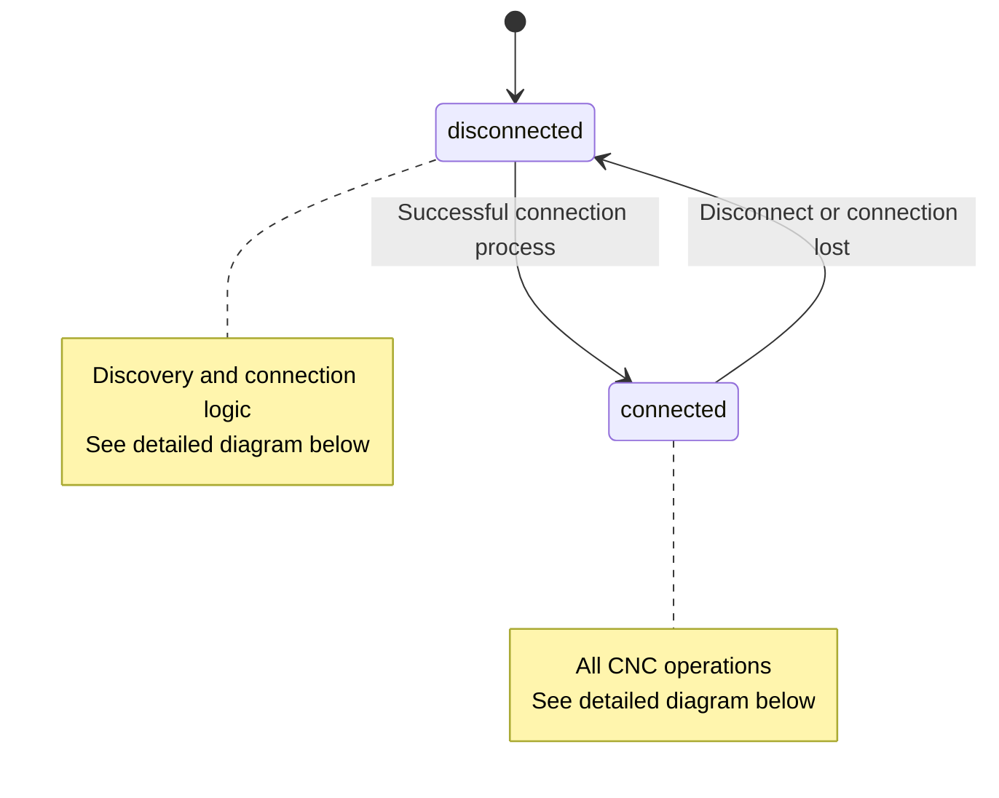
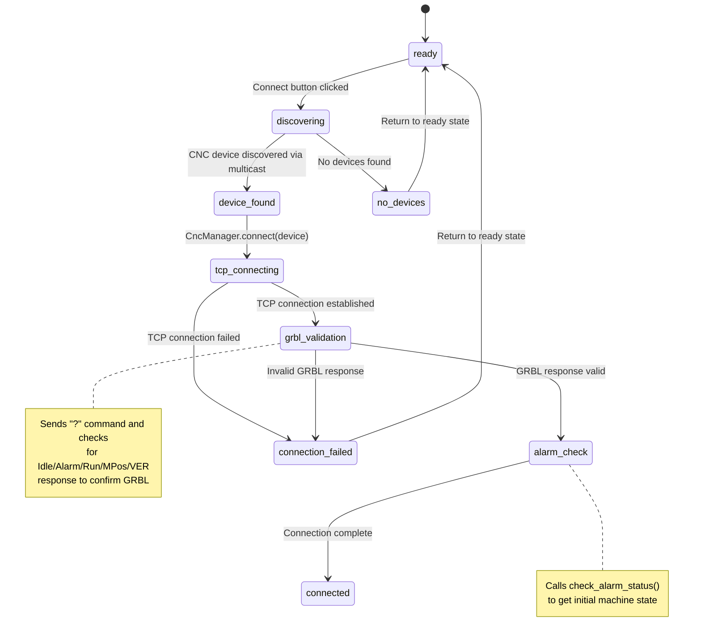
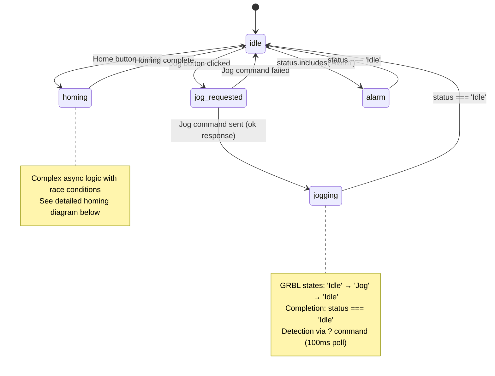
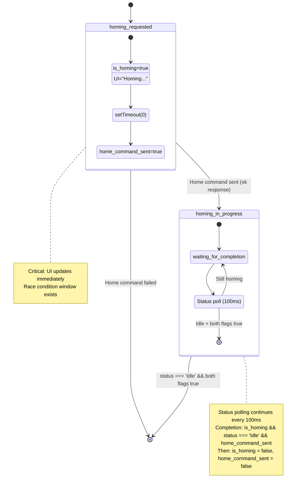
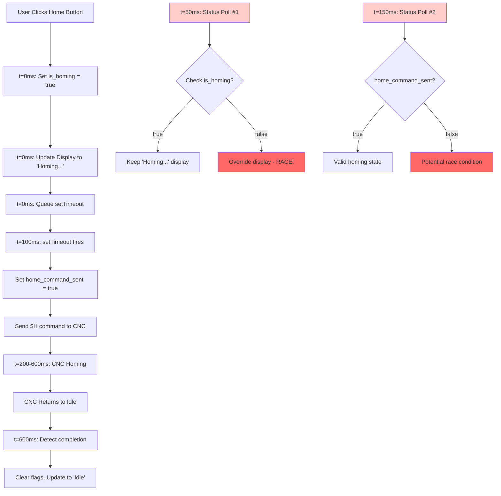

# CNC Homing State Diagrams

## Sequence Diagram - Homing Operation Flow

```mermaid
sequenceDiagram
    participant User
    participant UI as UI Thread
    participant StatusPoll as Status Polling (100ms)
    participant Backend as Tauri Backend
    participant CNC as GRBL/CNC

    Note over StatusPoll: Runs every 100ms continuously
    StatusPoll->>+Backend: get_status()
    Backend->>+CNC: "?"
    CNC-->>-Backend: "<Idle|MPos:...>"
    Backend-->>-StatusPoll: Parse response
    StatusPoll->>UI: Update display to "Idle"

    User->>+UI: Click "Home" button
    UI->>UI: is_homing = true
    UI->>UI: machine_state.textContent = "Homing..."
    UI->>UI: Log "Homing all axes..."
    UI-->>-User: Immediate visual feedback

    Note over UI: setTimeout(0) - defer to next tick
    UI->>UI: home_command_sent = true
    UI->>+Backend: CncManager.home()
    Backend->>+CNC: "$H"
    
    Note over StatusPoll,CNC: RACE CONDITION ZONE
    
    loop Status polling continues during homing
        StatusPoll->>+Backend: get_status()
        alt If CNC is still homing
            Backend->>+CNC: "?"
            CNC-->>-Backend: "<Home|MPos:...>" or no response
            Backend-->>-StatusPoll: Homing state or timeout
            StatusPoll->>StatusPoll: is_homing=true & !home_command_sent?
            Note over StatusPoll: Keep "Homing..." display
        else If homing just completed
            Backend->>+CNC: "?"
            CNC-->>-Backend: "<Idle|MPos:0,0,0>"
            Backend-->>-StatusPoll: Idle state
            StatusPoll->>StatusPoll: is_homing=true & home_command_sent=true & state="Idle"?
            StatusPoll->>StatusPoll: is_homing = false, home_command_sent = false
            StatusPoll->>UI: machine_state.textContent = "Idle"
            StatusPoll->>UI: Log "Homing completed"
        end
    end

    CNC-->>-Backend: Homing complete
    Backend-->>-UI: Home command response "ok"
    UI->>UI: Log "Home command: ok"

    Note over User,CNC: Potential Issues:
    Note over User,CNC: 1. Status poll might override "Homing..." before command sent
    Note over User,CNC: 2. Multiple rapid clicks could create race conditions
    Note over User,CNC: 3. Jog commands during homing might interfere
```

## High-Level State Diagram - Main Application States



## Disconnected State - Connection Process



## Connected State - CNC Operations



## Homing State - Detailed Race Condition Handling



## Timing Diagram - Race Condition Analysis



## Problem Analysis

### Race Condition Window (0-100ms)
Between setting `is_homing=true` and `home_command_sent=true`, status polling might override the display.

### Multiple Rapid Clicks
If user clicks Home multiple times quickly, we could have overlapping operations.

### Jog During Homing
If user jogs while homing, it could interfere with the state tracking.

### Status Polling Frequency
100ms polling might be too frequent and could cause timing issues.

## Potential Solutions

1. **Add button debouncing** - disable Home button immediately when clicked
2. **Add operation mutex** - prevent overlapping commands  
3. **Reduce status polling frequency during homing**
4. **Add more robust state validation**
