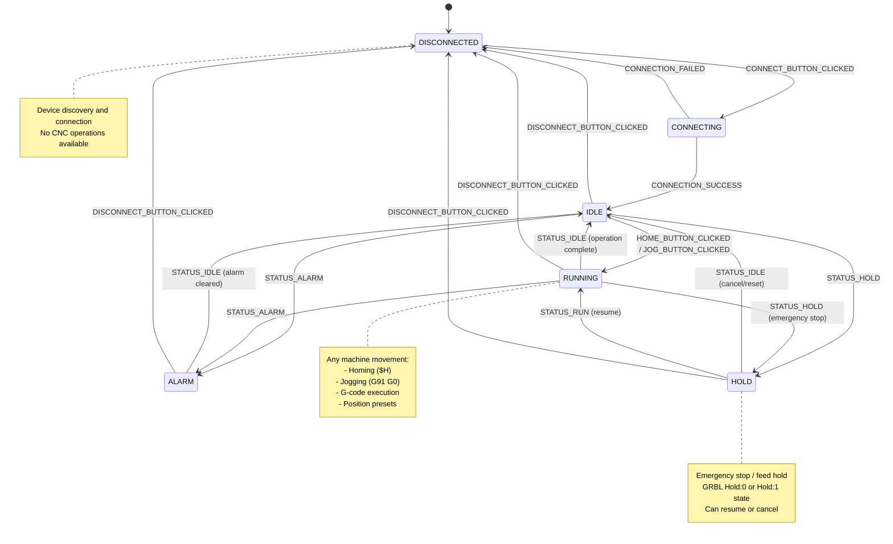
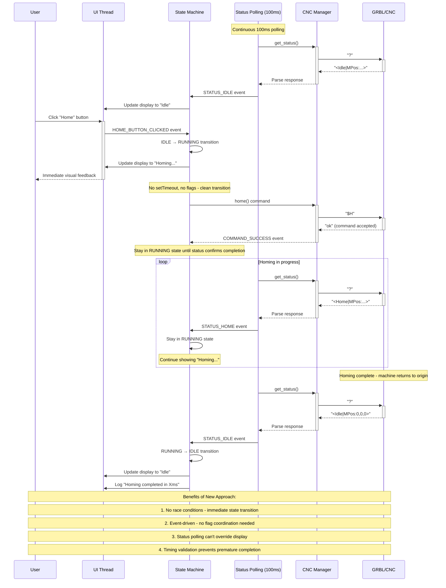
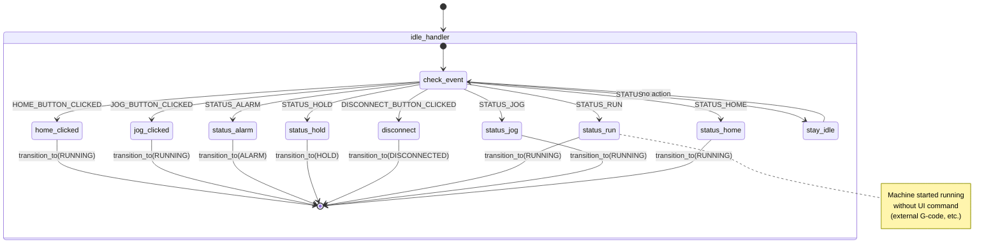
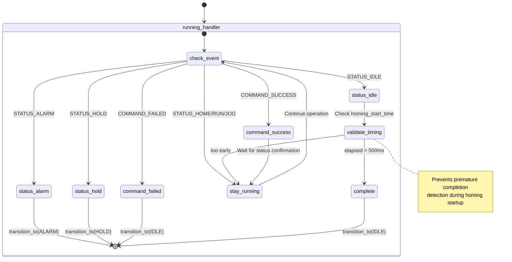
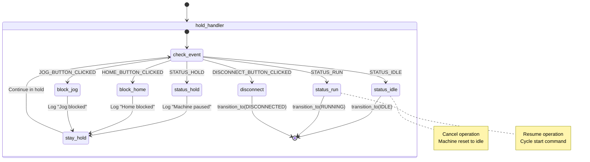
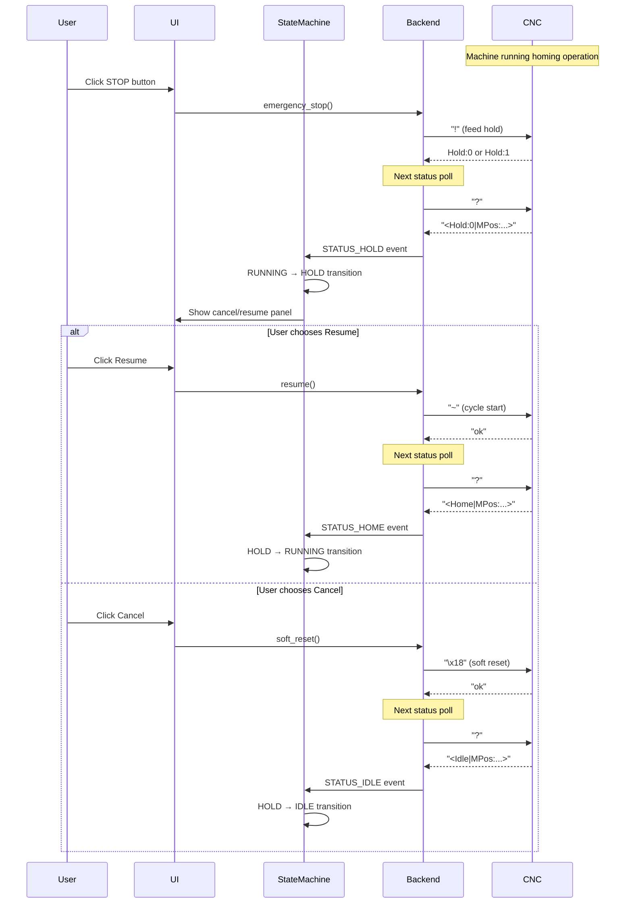
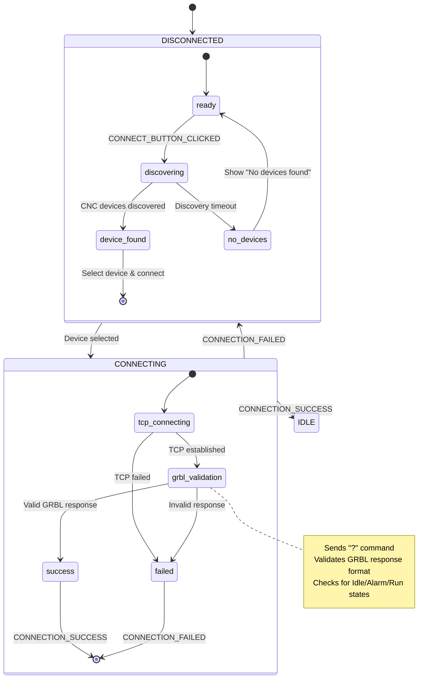

# CNC State Machine Diagrams

## High-Level State Machine Overview

## Event-Driven Homing Operation Flow

## Detailed State Handlers

### IDLE State Handler

### RUNNING State Handler

### HOLD State Handler (Emergency Stop)

## Emergency Stop Sequence

## Connection State Machine

## Key Improvements Over Old Implementation

### 1. **Eliminated Race Conditions**
- **Old**: Complex flag coordination with timing windows
- **New**: Immediate state transitions on user events

### 2. **Event-Driven Architecture**
- **Old**: Mixed polling and flag-based logic
- **New**: Pure event-driven state machine

### 3. **Cleaner Code Structure**
- **Old**: Scattered state logic with multiple files
- **New**: Centralized state machine with clear handlers

### 4. **Better Error Handling**
- **Old**: Basic error states
- **New**: Comprehensive alarm and hold state management

### 5. **Emergency Stop Support**
- **Old**: Not implemented
- **New**: Full GRBL Hold:0/Hold:1 support with resume/cancel

### 6. **Timing Validation**
- **Old**: Race conditions with rapid state changes
- **New**: Timing validation prevents premature transitions

## State Machine Benefits

1. **Predictable**: All state transitions are explicit and traceable
2. **Debuggable**: Clear event flow with comprehensive logging
3. **Maintainable**: New features add events, not complex flag logic
4. **Robust**: Handles edge cases and error conditions gracefully
5. **Extensible**: Easy to add new states (e.g., PROBING, RUNNING_JOB)
